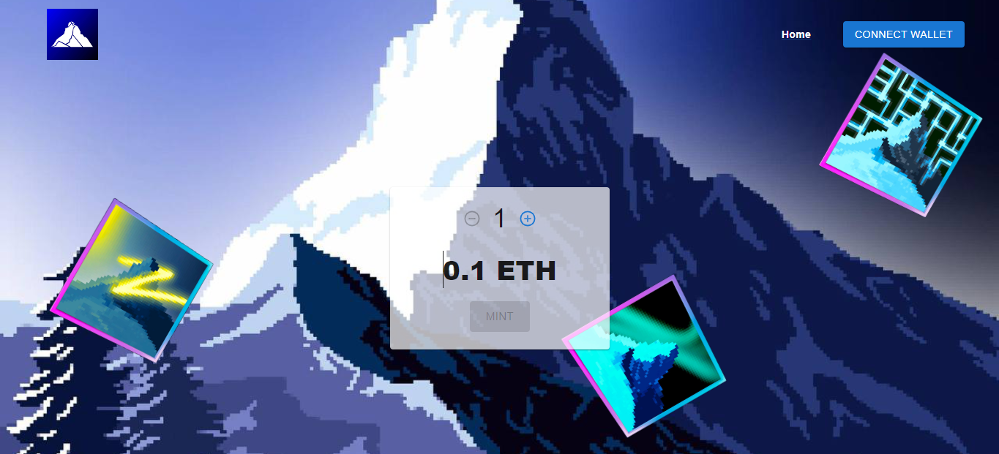
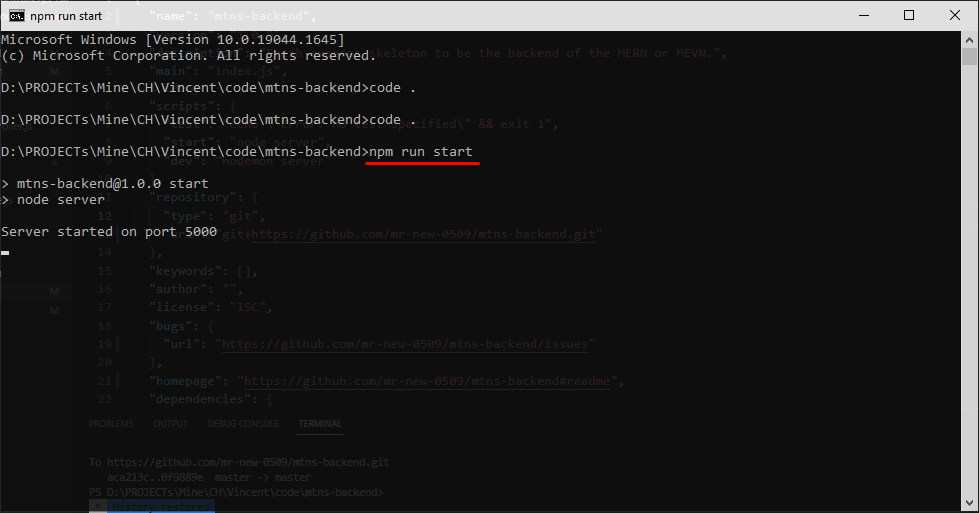

# The back-end of Mountains Club's NFT Mint site

## Live site

## Functionality
- Get the merkle root of whitelisted addresses
- Get the hex proof of an address

## Contact info
- **Email:** dejanteofilovic2@gmail.com
- **Discord:** [dejan_teofilovic](https://discord.gg/PztT2r5U)

## Release date
Nov 16, 2022

## Environment
- `Node.js v18.12.0`

## Stack
- **Framework:** `Express.js v4.17.3`

## How to run the project.
1. Please open terminal window in the root directory.
2. Please run command `npm run start` in it.

